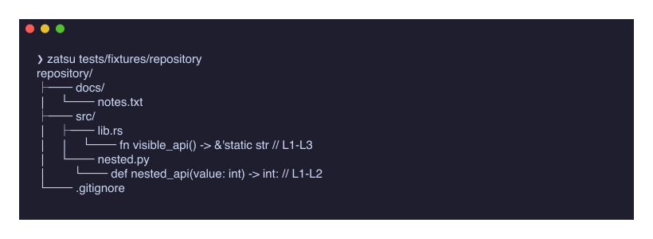

# zatsu

`zatsu` is a deterministic code-outline CLI for quickly understanding a
repository. In directory mode it prints a compact tree and symbol outlines
for supported source files; in file mode it prints the outline for one file.
Files matched by `.gitignore` are excluded from directory output.



The name is a playful continuation of upstream `zat` (from Japanese ざっと,
“at a glance”) and Japanese 雑 (*zatsu*), meaning “rough” or “informal”.

## Status

This repository contains the v0.1 CLI: repository directory mode, file mode,
symbol outlines, `.gitignore`-aware traversal, and output limits. Output is
intended to be stable and suitable for humans and coding agents.

## Installation

### Homebrew

```shell
brew install shohei81/tap/zatsu
```

### Cargo

```shell
cargo install --git https://github.com/shohei81/zatsu
```

Or build a local checkout:

```shell
cargo build --release
./target/release/zatsu .
```

Nix users can build the flake directly:

```shell
nix build github:shohei81/zatsu
```

## Usage

Pass a repository directory to show its file tree and source outlines:

```shell
zatsu
zatsu .
zatsu path/to/repository
```

With no path, `zatsu` inspects the current directory. Standard CLI metadata is
available with `zatsu --help` and `zatsu --version`.

Limit how deeply directory mode traverses a repository with `--max-depth` (or
`-d`). The root is depth 0, so `--max-depth 0` prints only the root. A directory
whose contents were omitted is marked with `… (max depth reached)`.

```shell
zatsu --max-depth 2 .
```

Limit normal output with `--max-lines` (or `-l`). This works in both directory
and file mode. If more output exists, `zatsu` adds one truncation notice after
the requested number of lines.

```shell
zatsu --max-lines 200 .
zatsu -d 3 -l 200 path/to/repository
```

Pass a source file to use file mode:

```shell
zatsu src/lib.rs
```

Use `--` before a path that starts with a hyphen:

```shell
zatsu -- ./-example.rs
```

Directory traversal respects `.gitignore`; ignored files are not included in
the tree or outlined. Supported languages are JavaScript, TypeScript, Rust,
Python, Go, Java, C, C++, C#, Swift, Kotlin, Haskell, Ruby, and Markdown.

Only public/exported symbols are shown where the language supports visibility
markers. Struct fields, enum variants, and interface members may be included.

## For AI agents

```markdown
## Tools

### zatsu

A deterministic repository and file outline viewer. In directory mode it shows
a `.gitignore`-aware file tree and source symbol outlines; in file mode it
shows one file's outline.

Prefer `zatsu` when you need signatures and structure rather than full
implementation. Use the reported line numbers to read only relevant sections.
```

## Upstream

`zatsu` is a GPL-3.0 fork of [bglgwyng/zat](https://github.com/bglgwyng/zat).
The upstream project provided the original tree-sitter outline engine and
language queries; this fork extends the product with repository-oriented
deterministic output. See [LICENSE](LICENSE) for the applicable license.
